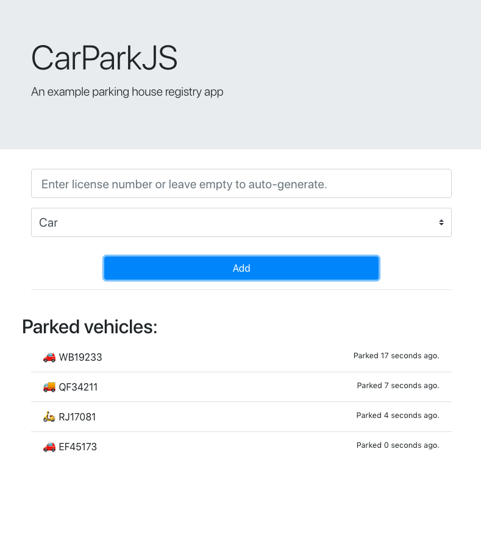

# CarParkJS

Example NodeJS/JavaScript (ES2018) project with classes and Jest-tests.

### Requirments:

- Node / NPM (v. 10 or newer)
- Git

The front-end is written in pure JA

### Setup:

```
$ git checkout https://github.com/dervism/carparkjs.git
$ cd carparkjs
$ npm install
```

### Running the application without frontend:

Run the command in a terminal or command window to start a simulation of a parking house:

```
$ node main
```

will output after 10 seconds:

```
Cars inside the parking house:
Car { licencePlateNr: 'NW46421', type: '🚗' }
Car { licencePlateNr: 'GS77737', type: '🚗' }
Car { licencePlateNr: 'CL46232', type: '🚚' }
Car { licencePlateNr: 'WV91362', type: '🛵' }
Simulating car park for 10 seconds
Car NW46421 has left the parking house.
The cost is 51.75387326388889
```

### Running the application with a frontend:

Run the command in a terminal or command window:

```
$ node carpark
```

then go to http://localhost:3000. You will see the following simple interface:




### The application is tested with Jest:

To run all tests and test coverage:

```
$ npm test
```