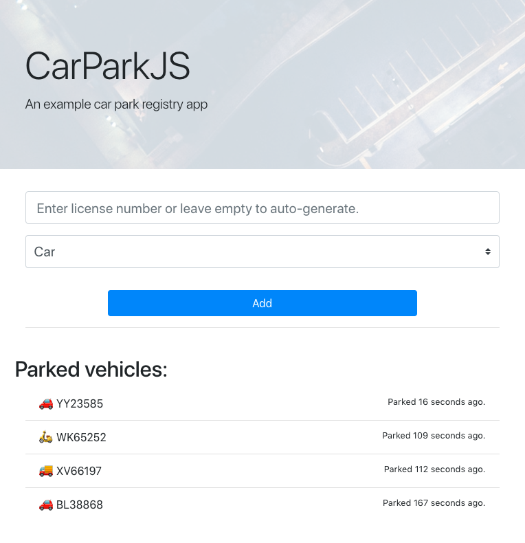

# CarParkJS

Example NodeJS/JavaScript (ES2018) project with classes and Jest-tests.

Requirments:

- Node / NPM (v. 10 or newer)

Setup:

```
$ npm install
```

Running the application:

```
$ node main
```

will output after 10 seconds:

```
Car { licencePlateNr: 'CC22853', type: '🚗' }
Simulating car park for 10 seconds
The cost is 51.75387326388889
```

The application is tested with Jest:

```
$ npm test
```

Screenshot:

